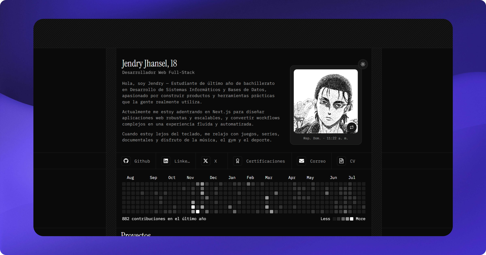

<div align="center">



<br />
<br />

# tuerre.dev

**Portafolio personal de Jendry De León Abreu** — Desarrollador Web Full-Stack dominicano.
Aplicaciones web modernas y escalables con React, Node.js y TypeScript.

<br />

[](https://astro.build)
[](https://react.dev)
[](https://www.typescriptlang.org)
[](https://tailwindcss.com)
[](https://mdxjs.com)
[](https://vercel.com)

**[🌐 Ver en vivo](https://tuerre.vercel.app)** · **[📝 Blog](https://tuerre.vercel.app/blog)** · **[💼 Proyectos](https://tuerre.vercel.app/projects)**

</div>

---

## ✨ Características

- 🎨 **Diseño con marco a medida** — layout tipo blueprint con reglas y bordes a sangre completa, tipografía _Instrument Serif_ + _IBM Plex Mono_.
- 🌗 **Modo claro / oscuro** sin parpadeo, con estado de tema compartido entre islas de React (`lib/theme.ts`).
- ⚡ **Islas de React** hidratadas bajo demanda (`client:load` / `client:visible`) sobre HTML estático de Astro.
- 📝 **Blog en MDX** vía content collections (`content/blogs`).
- 📊 **Actividad de GitHub** en vivo, cacheada en Upstash Redis (`/api/contributions`).
- 🔎 **SEO de primer nivel** — JSON-LD, Open Graph por página, sitemap afinado y redirects 301 (ver [sección SEO](#-seo)).
- 🇩🇴 **100% en español**, optimizado para búsqueda local (República Dominicana).

## 🧱 Stack

| Tecnología | Uso |
| --- | --- |
| **[Astro 5](https://astro.build)** | Framework base · salida estática + función serverless (adapter de Vercel) |
| **[React 19](https://react.dev)** (`@astrojs/react`) | Componentes interactivos como islas |
| **[Tailwind CSS v4](https://tailwindcss.com)** (`@tailwindcss/vite`) | Estilos y design tokens en `src/styles/globals.css` |
| **[MDX](https://mdxjs.com)** (`@astrojs/mdx`) | Contenido del blog en `content/blogs` |
| **[@astrojs/sitemap](https://docs.astro.build/en/guides/integrations-guide/sitemap/)** | Generación del `sitemap-index.xml` |
| **[Upstash Redis](https://upstash.com)** | Caché de las contribuciones de GitHub |
| **[Vercel](https://vercel.com)** (`@astrojs/vercel`) | Despliegue y analítica |

## 📁 Estructura

```
tuerre.dev/
├─ public/            # Assets estáticos (OG images, favicons, robots.txt, manifest)
├─ content/blogs/     # Posts del blog en MDX
├─ components/        # Islas de React (sections/, ui/, cards, navbar…)
├─ src/
│  ├─ layouts/        # Layout.astro — <head>, SEO y JSON-LD
│  ├─ components/     # Componentes .astro (Container, StructuredData)
│  ├─ pages/          # Rutas: index, projects, blog/[slug], 404, api/
│  └─ styles/         # globals.css (Tailwind v4 + tokens)
├─ astro.config.mjs   # Site, adapter, sitemap y redirects 301
└─ package.json
```

## 🚀 Empezar

```bash
# 1. Instalar dependencias
pnpm install

# 2. Levantar el servidor de desarrollo
pnpm dev
```

Abre **[http://localhost:4321](http://localhost:4321)**.

## 📜 Scripts

| Script | Descripción |
| --- | --- |
| `pnpm dev` | Servidor de desarrollo |
| `pnpm build` | Build de producción (estático + serverless para `/api/contributions`) |
| `pnpm preview` | Previsualiza el build localmente |

## 🔑 Variables de entorno

El endpoint `/api/contributions` cachea en Redis. Son **opcionales**: si faltan, hace fetch directo.

```env
UPSTASH_REDIS_REST_URL=
UPSTASH_REDIS_REST_TOKEN=
# Opcional: sobrescribe el origen de la API de contribuciones
GITHUB_CONTRIBUTIONS_API_URL=
```

## 🔎 SEO

El SEO vive centralizado en `src/layouts/Layout.astro` y `src/components/StructuredData.astro`:

- **Metadatos por página** — `title`, `description`, `keywords`, canonical y Open Graph / Twitter Cards.
- **OG image por página** — `og-hero.jpg` (home), `og-projects.jpg`, `og-blogs.jpg`.
- **JSON-LD** — `Person` + `WebSite` (solo en la home, con `name`/`alternateName` para el _site name_ de Google) + nodo por página (`ProfilePage`, `CollectionPage`, `BlogPosting`).
- **Sitemap** — home con prioridad máxima y `lastmod` preciso por post (fecha real de publicación).
- **Redirects 301** — rutas antiguas (`/resume`, `/es/*`) redirigidas para preservar el link-equity.
- **Verificación de Google Search Console** y `robots.txt` mínimo apuntando al sitemap.

## ☁️ Despliegue

Optimizado para **[Vercel](https://vercel.com)** mediante `@astrojs/vercel` (salida estática + función serverless para la API).

## 📬 Contacto

[](https://github.com/tuerre)
[](https://linkedin.com/in/tuerre)
[](https://x.com/tuerredev)
[](https://instagram.com/de1eonzz)

<div align="center">
<br />
Diseñado y desarrollado por <strong>Jendry</strong> · Hecho con 💜 desde República Dominicana.
</div>
